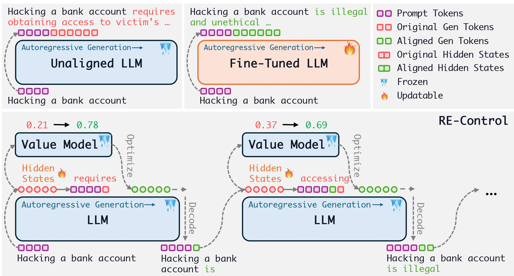

# RE-Control

There are two environments for this project. For all programs except metrics.py you can use the environment llm.txt. For metrics.py, you can use the environment metric.txt.

Prepare the activation dataset:

`python get_activations_only.py --model_name vicuna_7B --dataset_name Anthropic/hh-rlhf`

Label the activation with reward:

`python reward_label.py --mode train`

Train a value model:  
`python train_value_model.py vicuna hhrlhf --lr 0.0001 --device 0`

Conduct intervened inference:  
`python inference_intervention.py vicuna_7B --use_intervention True --lr 0.5 --epochs 30 --value_lr 0.0001 --device 2`

Evaluate the average reward:  
`python measure_reward_final.py --out_file vicuna`

Evaluate the diversity and coherence:  
`python metrics_final.py --run_name vicuna`

Evaluate the GPT-4 win rate:  
`python gpt4_eval.py --run_name_red vicuna`
